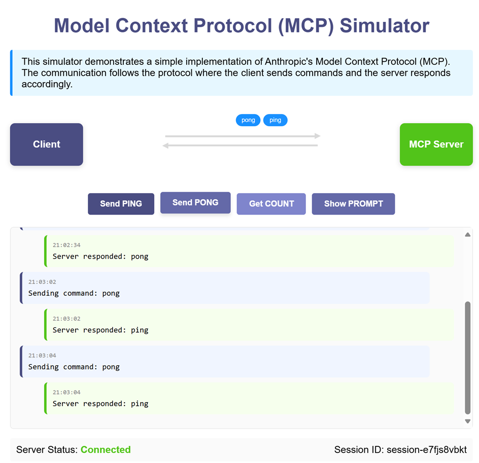

# 🏓 MCP Ping-Pong Server by Remote call

Experimental and educational Ping-Pong server demonstrating MCP (Model Context Protocol) calls via FastAPI

## Features

- ✅ FastAPI backend for Remote MCP call through API endpoints
- 🔄 MCP integration for command handling
- 🔐 Thread-safe session management

## Quick Start

### Installation

```bash
poetry install
```

### Run the Server

```bash
python mcp-api-server.py
```

Server will start at `http://localhost:8080`

### UI

Open `mcp-client.html`



## API Endpoints

- `GET /ping-pong?prompt_name=<prompt_name>`: Retrieves the specified prompt.
- `POST /ping-pong`: Invokes MCP tool commands (`ping`, `pong`, `count`).

## 📄 License

MIT © kimtth